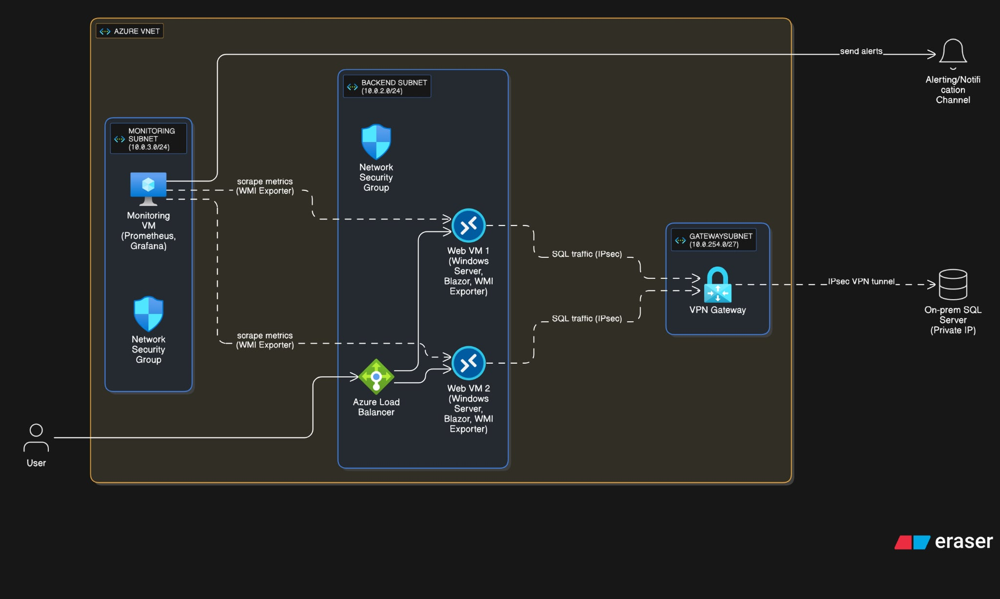

# Azure Infrastructure as Code Project

This project provisions a robust Azure infrastructure using Terraform for a Blazor web application deployment. It includes a resource group, virtual network, multiple subnets, network security groups (NSGs), a load balancer, public IPs, and virtual machines for backend web servers and monitoring.

## Project Structure

- **main.tf**: Core resources (resource group, virtual network, subnets)
- **nsg.tf**: Network Security Groups and their rules.
- **nsg-association.tf**: Associates NSGs with subnets and backend address pools with NICs
- **lb.tf**: Load balancer configuration (frontend, backend pool, probes, and rules)
- **public-ip.tf**: Public IP resources for the load balancer and monitoring VM
- **vms.tf**: Network interfaces and virtual machines (Windows and Linux)
- **extensions.tf**: VM extensions for monitoring setup only
- **vpn.tf**: VPN Gateway configuration for on-premises connectivity
- **variables.tf**: Input variables for customization
- **outputs.tf**: Useful outputs after deployment
- **terraform.tfvars**: Variable values (e.g., admin password)
- **provider.tf**: Provider configuration
- **backend.tf**: (Reserved for remote state configuration)
- **scripts/**: Contains setup scripts for IIS and monitoring tools
- **docs/**: Contains architecture diagrams and documentation assets

## Architecture Overview

This infrastructure follows a **two-tier deployment approach**:

1. **Infrastructure Provisioning**: Terraform creates the Azure resources
2. **Configuration Management**: PowerShell scripts handle application deployment and configuration

## Resources Deployed

### Core Resources

- **Resource Group**: `rg-internship`
- **Virtual Network**: `vnet01` (`10.0.0.0/16`)

### Subnets

- `backend-subnet` (`10.0.2.0/24`) - IIS web servers
- `monitoring-subnet` (`10.0.3.0/24`) - Prometheus/Grafana monitoring
- `GatewaySubnet` (`10.0.254.0/27`) - VPN Gateway for on-premises connectivity

### Network Security Groups (NSGs)

- **Backend NSG**: Allows HTTP (80), HTTPS (443), RDP (3389), WMI Exporter (9182), and SQL Server outbound (1433)
- **Monitoring NSG**: Allows SSH (22), Grafana (3000), and Prometheus (9090)

### Load Balancer

- **Name**: `web-load-balancer`
- **Frontend Configuration**: Static public IP
- **Backend Pool**: Includes both IIS VMs
- **Health Probe**: HTTP probe on port 80 at root path "/"
- **Rule**: HTTP traffic distribution on port 80

### Virtual Machines

- **vm-iis-01**: Windows Server 2022 for Blazor web application
- **vm-iis-02**: Windows Server 2022 for Blazor web application
- **vm-monitor**: Ubuntu 22.04 LTS for Prometheus and Grafana monitoring

### VPN Gateway

- **Purpose**: Provides secure connectivity to on-premises SQL Server
- **Type**: Route-based VPN Gateway (VpnGw1 SKU)
- **Client Pool**: `172.16.0.0/24` for P2S connections

### Public IPs

- **Load Balancer Public IP**: Static IP for web application access
- **Monitoring Public IP**: Dynamic IP for Grafana/Prometheus access
- **VPN Gateway Public IP**: Static IP for VPN connectivity

## Architecture Diagram



## Deployment Workflow

### Phase 1: Infrastructure Provisioning (Terraform)

1. **Core Infrastructure**: Resource group, virtual network, subnets
2. **Security**: Network security groups and associations
3. **Load Balancing**: Load balancer with backend pools and health probes
4. **Virtual Machines**: Windows and Linux VMs with base OS only
5. **Networking**: Public IPs, NICs, and VPN gateway
6. **Monitoring Setup**: Automated monitoring stack deployment via extension

### Phase 2: Application Configuration (Manual)

After infrastructure deployment, run the configuration script on each IIS VM:

```powershell
# Connect to VM via RDP and run:
powershell -ExecutionPolicy Unrestricted -File setup-iis-optimized.ps1
```

The script performs:

- IIS installation and configuration
- ASP.NET Core Hosting Bundle installation
- Blazor application deployment
- WMI Exporter installation for monitoring
- Database connection configuration

## Prerequisites

- [Terraform](https://www.terraform.io/downloads.html) >= 1.0
- Azure subscription and credentials (e.g., via `az login`)
- [Azure CLI](https://docs.microsoft.com/en-us/cli/azure/install-azure-cli) (optional, for authentication)
- RDP client for Windows VM configuration
- On-premises SQL Server accessible at `172.16.0.130:1433`

## Usage

### 1. Infrastructure Deployment

```sh
# Authenticate with Azure
az login

# Initialize Terraform
terraform init

# Review and customize variables
# Edit terraform.tfvars or override variables via CLI

# Plan the deployment
terraform plan -var-file="terraform.tfvars"

# Apply the configuration
terraform apply -var-file="terraform.tfvars"
```

### 2. Application Configuration

After infrastructure deployment:

1. **Connect to VMs**: Use RDP to connect to `vm-iis-01` and `vm-iis-02`
2. **Run Setup Script**: Execute the [`setup-iis-optimized.ps1`](scripts/setup-iis-optimized.ps1) script on each VM
3. **Verify Deployment**: Check application accessibility via load balancer IP

### 3. Monitoring Access

- **Grafana**: `http://<monitoring-vm-public-ip>:3000`
- **Prometheus**: `http://<monitoring-vm-public-ip>:9090`

### 4. Cleanup

```sh
terraform destroy -var-file="terraform.tfvars"
```

## Configuration Details

### Database Connectivity

- **SQL Server**: On-premises server at `172.16.0.130:1433`
- **Database**: `BlazorCrudApp`
- **Authentication**: SQL Server authentication
- **Connectivity**: Via VPN Gateway for secure access

### Application Settings

- **Deployment Type**: Self-contained .NET application
- **Application Pool**: No Managed Code (for .NET Core)
- **Hosting Model**: In-process hosting
- **Environment**: Production

### Monitoring Stack

- **Prometheus**: Metrics collection from WMI Exporters on Windows VMs
- **Grafana**: Dashboards and visualization
- **WMI Exporter**: Windows performance metrics (port 9182)

## Security Considerations

- **Passwords**: Admin password stored in [`terraform.tfvars`](terraform.tfvars). For production, use [Azure Key Vault](https://learn.microsoft.com/en-us/azure/key-vault/)
- **NSG Rules**: Review and restrict rules based on security requirements
- **Database Access**: Secured via VPN Gateway, no direct internet exposure
- **Application Security**: HTTPS configuration recommended for production

## Outputs

After deployment, Terraform outputs:

- Load balancer public IP
- VM details and private IPs
- Monitoring VM public IP
- Application and monitoring access URLs

## Troubleshooting

### Common Issues

1. **500.30 Error**: Usually indicates ASP.NET Core runtime missing or misconfigured
2. **Database Connection**: Verify VPN connectivity and SQL Server accessibility
3. **Load Balancer Health**: Check IIS status and application responsiveness

### Validation Steps

```powershell
# Test local application
.\BlazorApp1.exe

# Check database connectivity
Test-NetConnection -ComputerName "172.16.0.130" -Port 1433

# Verify IIS configuration
Get-Website
Get-WebAppPoolState
```

## Notes

- **Remote State**: Backend configuration not implemented. Edit [`backend.tf`](backend.tf) for remote state storage
- **Provider Version**: Uses AzureRM provider version `~> 3.0`
- **Hybrid Approach**: Combines Terraform for infrastructure and PowerShell for application configuration
- **Scalability**: Load balancer supports additional backend VMs if needed

## License

This project is licensed under the [MIT License](LICENSE).
